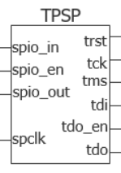
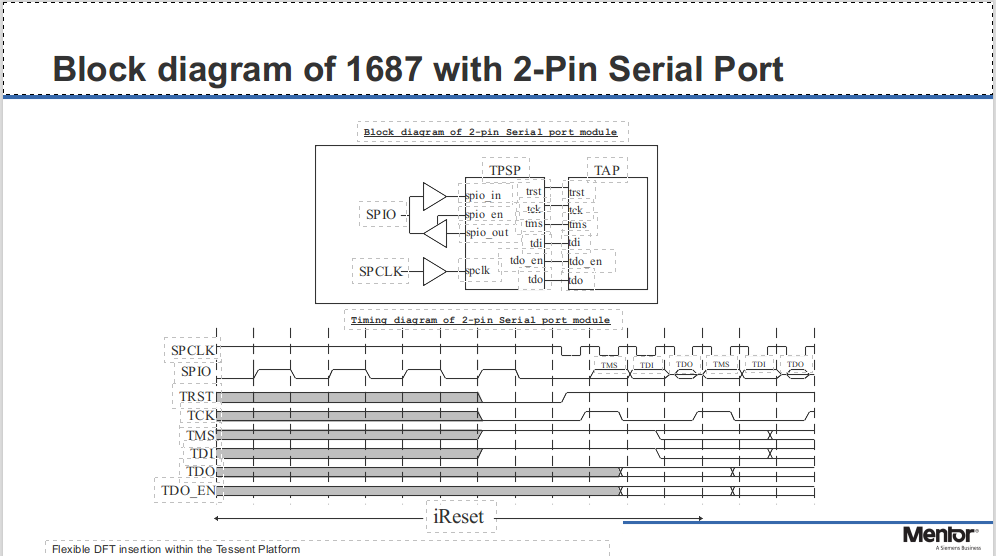
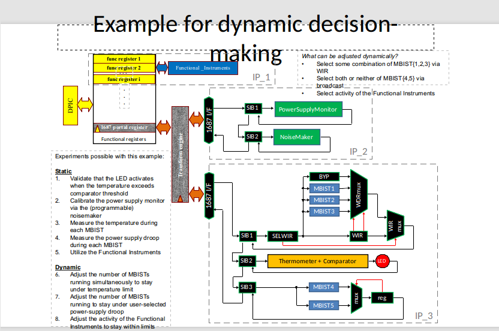
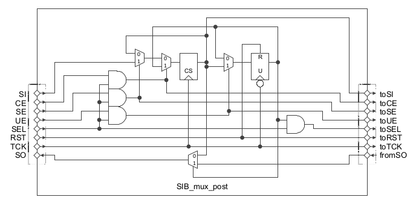
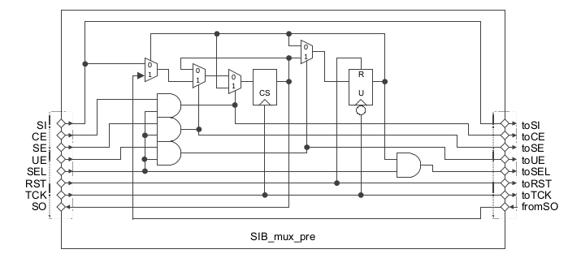
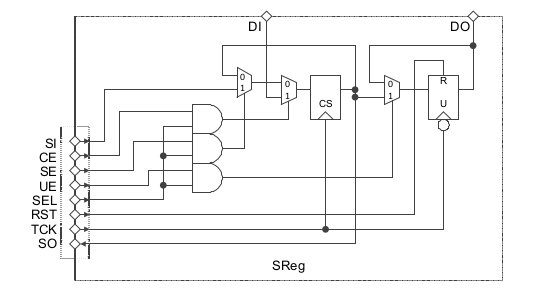

# P2654Simulation Project
The P2654Simulation project was created to
provide a platform for experimenting with
architectural concepts for both the IEEE P2654
*Standard for System Test Access Management
(STAM) to Enable Use of Sub-System Test
Capabilities at Higher Architectural
Levels* proposed
standard and the IEEE P1687.1 *Standard for
the Application of Interfaces and Controllers
to Access 1687 IJTAG Networks Embedded Within
Semiconductor Devices*.

Details for the IEEE P2654 group may be found
[here](https://standards.ieee.org/project/2654.html).

Details for the IEEE 1687.1 group may be found
[here](https://standards.ieee.org/project/1687_1.html). 

This project is a "*Work In Progress (WIP)*"
project that is undergoing a lot of change
and restructuring to figure out the best layout
to support the different perspectives required
by both of the working groups.

The code written for this project is licensed
using the GNU license as shown in the LICENSE.txt
file in the root directory.  Other projects
may be leveraged by this project to provide
modeling of interface buses, such as, AXI4, Avalon,
and Wishbone for use in porting the simulations
to FPGA designs for further testing.  Those
modules will be licensed using their respective
licensing models.
 
This project consists of both hardware designs,
provided as myHDL models (Verilog and VHDL are
possible to be generated from these myHDL
models) as well as software to interact with
these models as if the models were real
system hardware, but running as a simulation.
This allows for the construction of various
use cases with the hardware models and then
experiment with software architectures to
control these models in-system.

The dependencies required to run these simulations
may be found in the requirements.txt file.

The hardware models are described in the **hdl**
sub-directory of the project.  These will be
described in a separate section of this README.

Each of the hardware models that need to be
supported by IEEE Std 1687 retargeters must
have a corresponding Internal Connectivity
Language (ICL) description of its structure.
The corresponding ICL will be located in the
**icl** sub-directory following the same
directory structure of the hdl model.

The documentation about this project may be found
in the **docs** sub-directory.

## Hardware Definition Language Models (hdl)
The hardware models are decomposed of modular
parts.  Each partition of a system is broken
down into its smaller modules based on the
module type.  A board is assembled with devices.
Devices consist of controllers, instruments,
cores, and interfaces that have host and
client side elements.  Devices also require
interfaces at the board level to interconnect
devices together.
### boards
This directory contains the top level designs
for various board use case scenarios for use
in testing ideas for the IEEE P2654 proposed
standard.
### clients
This directory is to be used to model specialized
client interfaces that are reusable elements
for device or core designs.
### common
The core directory is used to contain common
logic blocks that are reusable for many types
of designs.
### controllers
This directory is to be used to model
specialized controller logic that is used
to interface to device pin or board edge
interfaces (e.g., JTAG controller, I2C Controller,
SPI Controller).  These controllers provide
an interface from software tools to the hardware
simulation environment.
### devices
The devices directory defines the various
forms of devices that may be found assembled
on a circuit board.  Each device type will
have its own sub-directory to contain all
the logic files required to describe it.
#### bridges
These devices are a family of devices that
bridge one protocol to another protocol.
For example, SPI to I2C or JTAG to I2C.
##### *tpsp*
The TPSP device class represents the interface
between a 2-pin Serial Protocol and the JTAG
IEEE Std 1149.1 Protocol.  It was presented
by Martin Keim from Mentor Graphics to help
model the retargeting between two different
protocol domains by looking at the signal
states as a series of cycles instead of just
the raw data.  The TPSP logic looks like the
following logic diagram:



The TPSP protocol description may be found below
and consists of 3 cycles on the serial port
(TMS, TDI, TDO) corresponding to a single
cycle on the JTAGInterface side.



```python
class TPSP:
    """
    Class structure implementing the RTL for the interface logic.
    """

    def __init__(self, name, spclk, reset_n, spio_in, spio_en, spio_out,
                 jtag_interface, tdi, tdo, tdo_en,
                 power_usage_register, thermal_register):
        """
        Constructor to create an instance of the MBIST Simulated Instrument
        :param name: String containing the instance name to be printed in diagnostic messages
        :param spclk: Clock signal used to change state and tick the delay times for delay states
        :param reset_n: Reset signal for state machine. 0=Reset, 1=No reset
        :param spio_in: Data Input Signal
        :param spio_en: Control Signal to enable the SPIO_OUT to the SPIO bus
        :param spio_out: Data Output Signal
        :param jtag_interface: JTAGInterface object defining the JTAG signals used by this controller
        :param tdi: Test Data Input signal of the jtag_interface for this device
        :param tdo: Test Data Output signal of the jtag_interface for this device
        :param tdo_en: Test Data Output Enable input signal for the jtag_interface for this device
        :param power_usage_register: Signal(intbv(0, min=0, max=101)) signal representing 0 - 100% power usage
                that changes over time depending on the operation being performed.  The power monitor would
                monitor this value and report how much total power in the system is being used.
        :param thermal_register: Signal(intbv(0, min=0, max=101)) signal representing 0 - 100% themal usage
                that changes over time depending on the operation being performed.  The tempurature monitor
                would monitor this value and report the temperature the system is producing.
        """
```
#### use_cases
##### *rearick*
This class represents the use case device
Jeff Rearick from AMD proposed as the test
design for IEEE P1687.1 to benchmark against
as we study the various issues and solutions
identified for the standard.  The device consists
of the following elements:



### hosts
This directory is to be used to model specialized
host interfaces that are reusable elements
for device or core designs.
#### *jtaghost*
This directory contains the modules making up
the host interface to the IEEE Std 1149.1 interface
of a board or device accessible from software
tools.
##### *JTAGHost*
Top level entity the software would connect
to via register access from a memory mapped bus
like Wishbone or AXI4.  This is a WIP module.
##### *JTAGCtrlMaster*
This class is a JTAG host block adapted from the OpenCores.org
jtag_master project that was originally implemented in VHDL.
Some logic had to be changed due to multiple driver errors
detected by the conversion audits when converting the myHDL
to Verilog or VHDL.  In the JTAG_Ctrl_Master.py file there are some
utility methods for test benches that provide for performing
ScanIR and ScanDR operations over the JTAG interface to a client
DUT.  The TDI and TDO vectors for these methods are arrays of
integers whose size must be less than 2**data_width defined
for the instance.  The design uses a Block RAM for storing the
vector data and capturing the responses in the same buffer
by overwriting the scanned out bits with the capture bits
during the scan process.  The interface to the instrument
uses a synchronous clock to latch the data written to the
memory data bus as well as command signals to start the
scan.  The host software needs to define the the type of
scan operation or use the provided utility methods.  Control
of this instrument must be performed by a generator method
running as part of the simulation (see the testbench method
in JTAG_Ctrl_Master.py as an example).
The interface code snippet may be found here:

```python
    def write_vector(self, addr, data):
        """
        Non-convertable code
        This code is used to simplify writing of test benches
        :param addr: Address of memory buffer to store the next segment of the vector into (size of data_width)
        :param data: The contents to be written into the memory buffer of the master (size of data_width)
        :return:
        """
        yield self.clk.negedge
        self.addr.next = addr
        self.din.next = data
        self.wr.next = bool(1)
        yield self.clk.posedge
        yield self.clk.negedge
        self.wr.next = bool(0)
        yield self.clk.posedge
        self.addr.next = 0

    def read_vector(self, addr):
        """
        Non-convertable code
        This code is used to simplify writing of test benches
        :param addr: Address of memory buffer to fetch the next segment of the vector from (size of data_width)
        :return:
        """
        yield self.clk.negedge
        self.addr.next = addr
        self.wr.next = bool(0)
        yield self.clk.posedge
        self.read_data.next = self.dout
        yield self.clk.negedge
        yield self.clk.posedge
        self.addr.next = 0

    def get_read_data(self):
        """
        Returns the value fetched by the read_vector call
        :return:
        """
        return self.read_data

    def scan_vector(self, tdi_vector, count, tdo_vector, start, end):
        """
        Scan the vector to the TAP with the IR data and capture the response in tdo_vector
        :param tdi_vector: Array of integers for the data to be shifted out (tdi_vector[0] is first integer sent)
        :param count: number of bits to shift
        :param tdo_vector: Array of integers for the data to be captured into (tdo_vector[0] is first integer captured)
        :param start: JTAGCtrlMaster.SHIFTIR or SHIFTDR
        :param end: JTAGCtrlMaster.RUN_TEST_IDLE
        :return:
        """
        # Fill the JTAGCtrlMaster data buffer memory with tdi data
        num_full_words = int(count // self.data_width)
        remainder = count % self.data_width
        addr = intbv(0)[self.addr_width:]
        for i in range(num_full_words):
            data = intbv(tdi_vector[i])[self.data_width:]
            yield self.write_vector(addr, data)
            addr = addr + 1
        # Now write out the remaining bits that may be a partial word in size, but a full word needs to be written
        if remainder > 0:
            data = intbv(tdi_vector[num_full_words])[self.data_width:]
            yield self.write_vector(addr, data)
        # Now start the scan operation
        self.bit_count.next = intbv(count)[self.addr_width:]
        self.shift_strobe.next = bool(1)
        self.state_start.next = start
        self.state_end.next = end
        yield self.busy.posedge
        self.shift_strobe.next = bool(0)
        yield self.busy.negedge
        # Scan completed, now fetch the captured data
        addr = intbv(0)[self.addr_width:]
        for i in range(num_full_words):
            yield self.read_vector(addr)
            data = self.get_read_data()
            tdo_vector[i] = int(data)
            addr = addr + 1
        # Now read out the remaining bits that may be a partial word in size, but a full word needs to be read
        if remainder > 0:
            yield self.read_vector(addr)
            data = self.get_read_data()
            tdo_vector[num_full_words] = int(data)

    def scan_ir(self, tdi_vector, count, tdo_vector):
        """
        Scan the vector to the TAP with the IR data and capture the response in tdo_vector
        :param tdi_vector: Signal(intbv(0)[count:]) Data to be shifted out
        :param count: number of bits to shift
        :param tdo_vector: Signal(intbv(0)[count]) Data to be captured
        :return:
        """
        start = JTAGCtrlMaster.SHIFT_IR
        end = JTAGCtrlMaster.RUN_TEST_IDLE
        yield self.scan_vector(tdi_vector, count, tdo_vector, start, end)

    def scan_dr(self, tdi_vector, count, tdo_vector):
        """
        Scan the vector to the TAP with the DR data and capture the response in tdo_vector
        :param tdi_vector: Signal(intbv(0)[count:]) Data to be shifted out
        :param count: number of bits to shift
        :param tdo_vector: Signal(intbv(0)[count]) Data to be captured
        :return:
        """
        start = JTAGCtrlMaster.SHIFT_DR
        end = JTAGCtrlMaster.RUN_TEST_IDLE
        yield self.scan_vector(tdi_vector, count, tdo_vector, start, end)
```

The example test bench showing how to use these utility methods
is shown below:

```python
    @staticmethod
    @block
    def testbench(monitor=False):
        """
        Test bench interface for a quick test of the operation of the design
        :param monitor: False=Do not turn on the signal monitors, True=Turn on the signal monitors
        :return: A list of generators for this logic
        """
        addr_width = 10
        data_width = 8
        clk = Signal(bool(0))
        reset_n = ResetSignal(1, active=0, async=True)
        # JTAG Part
        bit_count = Signal(intbv(0)[16:])
        shift_strobe = Signal(bool(0))
        tdo = Signal(bool(0))
        tck = Signal(bool(0))
        tms = Signal(bool(0))
        tdi = Signal(bool(0))
        trst = Signal(bool(1))
        busy = Signal(bool(0))
        state_start = Signal(intbv(JTAGCtrlMaster.TEST_LOGIC_RESET)[4:])
        state_end = Signal(intbv(JTAGCtrlMaster.TEST_LOGIC_RESET)[4:])
        state_current = Signal(intbv(JTAGCtrlMaster.TEST_LOGIC_RESET)[4:])
        # Ram Part
        addr = Signal(intbv(0)[addr_width:])
        wr = Signal(bool(0))
        din = Signal(intbv(0)[data_width:])
        dout = Signal(intbv(0)[data_width:])
        ir_tdi_vector = [0x55, 0x19]
        ir_tdo_vector = [0, 0]
        dr_tdi_vector = [0xA5, 0x66]
        dr_tdo_vector = [0, 0]
        count = 15

        jcm_inst = JTAGCtrlMaster('DEMO', 'JCM0',
                                  clk,
                                  reset_n,
                                  bit_count, shift_strobe,
                                  tdo, tck, tms, tdi, trst,
                                  busy,
                                  state_start, state_end, state_current,
                                  addr, wr, din, dout,
                                  addr_width=addr_width,
                                  data_width=data_width)

        @always(delay(10))
        def clkgen():
            clk.next = not clk

        @always_seq(clk.posedge, reset=reset_n)
        def loopback():
            tdo.next = tdi

        @instance
        def stimulus():
            """
            Scan an IR followed by a scan of a DR
            :return:
            """
            H = bool(1)
            L = bool(0)
            # Reset the instrument
            reset_n.next = bool(0)
            yield delay(2)
            reset_n.next = bool(1)
            yield delay(50)
            # Scan the IR
            yield jcm_inst.scan_ir(ir_tdi_vector, count, ir_tdo_vector)
            print("ir_tdo_vector = ", ir_tdo_vector)
            assert(ir_tdo_vector == [0x55, 0x19])  # Captured TDO value returned to ir_tdo_vector
            yield jcm_inst.scan_dr(dr_tdi_vector, count, dr_tdo_vector)
            print("dr_tdo_vector = ", dr_tdo_vector)
            assert(dr_tdo_vector == [0xA5, 0x66])  # Captured TDO value returned to dr_tdo_vector
            raise StopSimulation()

        return jcm_inst.JTAGCtrlMaster_rtl(monitor=monitor), clkgen, stimulus, loopback
```

##### *JTAGShiftBlock*
This class describes the shift cycle hardware
to read the values to be shifted out from a
FIFO interface and to store the values captured
from the DUT into a FIFO output memory via
a FIFO bus interface. The user would store data
to be scanned in the send buffer and then command
the JTAGHost to send the data.  The JTAGHost
would place the captured data in the receive
buffer for the user to read out.  This is a
WIP module.
### instruments
This directory contains the models for various
instruments to be used during the simulations.
These instruments make up the elements identified
in the various use cases found by the working
groups.
#### *simulatedmbist*
The simulatedmbist class represents a fictional
Memory BIST entity inside a device that tests
a block of memory inside the device.  The
model does not actually test a memory block,
but instead simulates the time taken and
the power and temperature profiles the instrument
would have on a device.
```python
class simulatedmbist:
    """
    Class structure implementing the RTL for the instrument.
    """
    def __init__(self, name, clock, reset_n, control_register, status_register, power_usage_register,
                 thermal_register, initialize_delay=10, test_delay=30, analyze_delay=20):
        """
        Constructor to create an instance of the MBIST Simulated Instrument
        :param name: String containing the instance name to be printed in diagnostic messages
        :param clock: Clock signal used to change state and tick the delay times for delay states
        :param reset_n: Reset signal for state machine. 0=Reset, 1=No reset
        :param control_register[0:7]: Parallel register to control the operation of the instrument
                Bit0: 1=Start the BIST operation, 0=NOP for status scans
                Bit1: 1=Stop the BIST operation and abort, 0=Do not abort the test
                Bit2: 1=Inject error during test_delay state, 0=Do not inject error during test_delay state
                Bit3: 1=Inject error during analyze_delay state, 0=Do not inject error during analyze_delay state
                Bit4: 1=Double the initialize_delay time to use at start, 0=Use the specified initialize_delay
                Bit5: 1=Double the test_delay time to use at start, 0=Use the specified test_delay
                Bit6: 1=Double the analyze_delay time to use at start, 0=Use the specified analyze_delay
        :param status_register[0:7]: Parallel register to publish the status of the instrument operation
                Bit0: 1=Test passed, 0=Test failed
                Bit1: 1=MBIST test is running, 0=MBIST test is not running
                Bit2: 1=Test aborted due to unknown error, 0=Test did not abort
                Bit3: 1=Error during test state detected, 0=No error detected during test state
                Bit4: 1=Error during analyze state detected, 0=No error detected during analyze state
                Bit5: Reserved.  Added so status_register can be capture register and control_register as update
                Bit6: Reserved.  Added so status_register can be capture register and control_register as update
        :param power_usage_register: Signal(intbv(0, min=0, max=101)) signal representing 0 - 100% power usage
                that changes over time depending on the operation being performed.  The power monitor would
                monitor this value and report how much total power in the system is being used.
        :param thermal_register: Signal(intbv(0, min=0, max=101)) signal representing 0 - 100% thermal usage
                that changes over time depending on the operation being performed.  The temperature monitor
                would monitor this value and report the temperature the system is producing.
        :param initialize_delay: Keyword argument to specify the number of clock ticks to spin in initialize state
        :param test_delay: Keyword argument to specify the number of clock ticks to spin in the test state
        :param analyze_delay: Keyword argument to specify the number of clock ticks to spin in the analyze state
        """
```
### standards
The standards directory contains reusable
models for specific standards that are needed
to model other elements of a device.  Each
standard has its own directory containing the
reusable modules for that standard.
#### p1687dot1
This directory contains examples of P1687.1
transform engines and DPIC interfaces for testing
different ideas surrounding the standard.
#### s1149dot1
This directory contains the following models
used to provide reusable components/designs
for devices adhering to the IEEE Std 1149.1
standard for access to embedded instrumentation.
##### *JTAGInterface*
The JTAGInterface provides a class containing
the bused interface signals of the device pin
interface.  It does not contain the TDI and
TDO signals as they need to be individually
connected serially between devices.
```python
class JTAGInterface:
    def __init__(self):
        self.TCK = Signal(bool(0))
        self.TMS = Signal(bool(1))
        self.TRST = Signal(bool(1))
```
##### *JTAGState*
The JTAGState class provides a convenient method
for capturing the state information from the
Std1149_1_TAP for diagnostic purposes.  The
state is a 4 bit value indicating what state
the TAP State Machine is in during execution.
The following states and corresponding values
are shown below:

|Controller STATE | DCBA Hex Value|
|:---:|:---:|
|   EXIT2DR    |       0      |
|   EXIT1DR    |       1      |
|   SHIFTDR    |       2      |
|   PAUSEDR    |       3      |
|   SELECTIR   |       4      |
|   UPDATEDR   |       5      |
|   CAPTUREDR  |       6      |
|   SELECTDR   |       7      |
|   EXIT2IR    |       8      |
|   EXIT1IR    |       9      |
|   SHIFTIR    |       A      |
|   PAUSEIR    |       B      |
| RUNTEST/IDLE |       C      |
|   UPDATEIR   |       D      |
|   CAPTUREIR  |       E      |
|    RESET     |       F      |

The value inside the class is accessible to
view or print out the current state of the
associated Std1149_1_TAP the class instance
is attached to.

```python
class JTAGState:
    def __init__(self):
        self.value = Signal(intbv(15, min=0, max=16))
```
##### *Std1149_1_TAP*
This module implements the IEEE Std 1149.1
TAP Controller that interfaces the device
pins with the internal scan logic as per the
1149.1 standard.  It takes as ports an
instance of the JTAGInterface class to describe
the pin interface of the device, an instance
of the JTAGState class to monitor the state
status of the TAP Controller, and an instance
of the TAPInterface class that describes the
signals used to interface with the scan logic
inside the device.
```python
class Std1149_1_TAP:
    def __init__(self, jtag_interface, state, tap_interface):
        """
        TAP Controller logic
        :param jtag_interface: JTAGInterface object defining the JTAG signals used by this controller
        :param state: Monitor signal state with this 4 bit encoding
        :param tap_interface: TAPInterface object defining the TAP signals managed by this controller
        :return:
        """
```
##### *TAPInterface*
This class defines the bused interface signals
used to control the scan logic inside the device
that is used to implement the Instruction
Register and Data Registers providing access
to the logic inside the device.
```python
class TAPInterface:
    def __init__(self):
        self.Reset = Signal(bool(0))
        self.Enable = Signal(bool(0))
        self.ShiftIR = Signal(bool(0))
        self.CaptureIR = Signal(bool(0))
        self.ClockIR = Signal(bool(0))
        self.UpdateIR = Signal(bool(0))
        self.ShiftDR = Signal(bool(0))
        self.CaptureDR = Signal(bool(0))
        self.ClockDR = Signal(bool(0))
        self.UpdateDR = Signal(bool(0))
        self.UpdateDRState = Signal(bool(0))
        self.Select = Signal(bool(0))
```
##### *TDR*
The TDR class implements the logic for a Test
Data Register following the convention of
the IEEE Std 1149.1 standard.  This register
provides access to the read and write side of
parallel registers of an embedded instrument
or pin interfaces, such as the Boundary Scan
Register used to test the continuity between
devices.
```python
class TDR:
    def __init__(self, path, name, D, Q, scan_in, tap_interface, local_reset, scan_out, tdr_width=9):
        """
        :param path: Dot path of the parent of this instance
        :param name: Instance name for debug logging (path instance)
        :param D: tdr_width bit wide Signal array of intbv(bool) as the mission input [Signal(bool(0)) for i in range(tdr_width)]
        :param Q: tdr_width bit wide Signal array of intbv(bool) as the mission output [Signal(bool(0)) for i in range(tdr_width)]
        :param scan_in: Input signal for data scanned into TDR
        :param tap_interface: TAPInterface object containing:
            CaptureDR: Signal used to enable the capture of D
            ShiftDR: Signal used to shift the data out ScanOut from the TDR
            UpdateDR: Signal used to latch the TDR to Q
            Select: Signal used to activate the TDR
            Reset: Signal used to reset the Q of the TDR
            ClockDR: Test Clock used to synchronize the TDR to the TAP
        :param local_reset: Signal used by the internal hardware to reset the TDR
        :param scan_out: Output signal where data is scanned from the TDR
        """
```
##### *TIR*
The TIR class implements the logic for the
Test Instruction Register used to select the
desired TDR to be accessed during a SHIFTDR
state sequence.
```python
class TIR:
    def __init__(self, path, name, D, Q, scan_in, tap_interface, local_reset, scan_out, tir_width=9):
        """
        :param path: Dot path of the parent of this instance
        :param name: Instance name for debug logging (path instance)
        :param D: tir_width bit wide Signal array of intbv(bool) as the mission input [Signal(bool(0)) for i in range(tir_width)]
        :param Q: tir_width bit wide Signal array of intbv(bool) as the mission output [Signal(bool(0)) for i in range(tir_width)]
        :param scan_in: Input signal for data scanned into TIR
        :param tap_interface: TAPInterface object containing:
            CaptureIR: Signal used to enable the capture of D
            ShiftIR: Signal used to shift the data out ScanOut from the TIR
            UpdateIR: Signal used to latch the TIR to Q
            Reset: Signal used to reset the Q of the TIR
            ClockIR: Test Clock used to synchronize the TIR to the TAP
        :param local_reset: Signal used by the internal hardware to reset the TIR
        :param scan_out: Output signal where data is scanned from the TIR
        """
```
#### s1687
This directory contains the following models
used to provide reusable components/designs
for devices adhering to the IEEE Std 1687
standard for access to embedded instrumentation.
##### *IJTAGInterface*
The IJTAGInterface provides a class
containing the bused interface signals of
the 1687 host to client interface. It does
not contain the SI and SO signals as they
need to be individually connected serially
between 1687 network elements.
```python
class IJTAGInterface:
    def __init__(self):
        self.SELECT = Signal(bool(0))
        self.CAPTURE = Signal(bool(0))
        self.SHIFT = Signal(bool(0))
        self.UPDATE = Signal(bool(0))
        self.RESET = Signal(bool(0))
        self.CLOCK = Signal(bool(0))
```
##### *sib_mux_post*
The sib_mux_post class describes the design
of the 1687 Segment Insertion Bit (SIB) where
the included sub-network is inserted after
the SIB control bit in the scan vector.
This design adheres to the example in the
Figure F.10 of the standard as shown below: 



The class provides the client interface from
the network to the host interface (from side)
to the sub-network (to side) using 2 separate
IJTAGInterface instances: one for the from (network)
side and one for the to (instrument) side.
```python
class sib_mux_post:
    """
    This class implements the logic from Figure F.10 in the IEEE Std 1687 standard.
    """
    def __init__(self, path, name, si, from_ijtag_interface, so, to_si, to_ijtag_interface, from_so):
        """
        Segment-Insertion-Bit (SIB) to allow the overall scan chain to be of variable length.
        Creates a Module SIB for IEEE 1687 with the following interface:
        :param path: Dot path of the parent of this instance
        :param name: Instance name for debug logging (path instance)
        :param si: Scan Input from host interface
        :param from_ijtag_interface: IJTAGInterface defining the control signals for this register "from" side
        :param so: Scan Output to host interface from SIB
        :param to_si: Scan Input to instrument interface
        :param to_ijtag_interface: IJTAGInterface defining the control signals for this register "to" side
        :param from_so: Scan Output from instrument interface
        """
```
##### *sib_mux_pre*
The sib_mux_pre class describes the design
of the 1687 Segment Insertion Bit (SIB) where
the included sub-network is inserted before
the SIB control bit in the scan vector.
This design adheres to the example in the
Figure F.12 of the standard as shown below: 



The class provides the client interface from
the network to the host interface (from side)
to the sub-network (to side) using 2 separate
IJTAGInterface instances: one for the from (network)
side and one for the to (instrument) side.
```python
class sib_mux_pre:
    """
    This class implements the logic from Figure F.12 in the IEEE Std 1687 standard.
    """
    def __init__(self, path, name, si, from_ijtag_interface, so, to_si, to_ijtag_interface, from_so):
        """
        Segment-Insertion-Bit (SIB) to allow the overall scan chain to be of variable length.
        Creates a Module SIB for IEEE 1687 with the following interface:
        :param path: Dot path of the parent of this instance
        :param name: Instance name for debug logging (path instance)
        :param si: Scan Input from host interface
        :param from_ijtag_interface: IJTAGInterface defining the control signals for this register "from" side
        :param so: Scan Output to host interface from SIB
        :param to_si: Scan Input to instrument interface
        :param to_ijtag_interface: IJTAGInterface defining the control signals for this register "to" side
        :param from_so: Scan Output from instrument interface
        """
```
##### *SReg*
The SReg class describes the generic scan
register as described in Figure F.2 of the
standard with the distinction of supporting
a user defined number of bits instead of just
a single bit.



The class provides a client interface to the
1687 network as well as handles to capture
and update parallel registers.
```python
class SReg:
    def __init__(self, path, name, si, ijtag_interface, so, di, do, dr_width=9):
        """
        Creates a Module SReg for IEEE 1687 with the following interface:
        :param path: Dot path of the parent of this instance
        :param name: Instance name for debug logging (path instance)
        :param si: ScanInPort
        :param ijtag_interface: IJTAGInterface defining the control signals for this register
        :param so: ScanOutPort
        :param di: DataInPort [Signal(bool(0) for _ in range(dr_width)]
        :param do: DataOutPort [Signal(bool(0) for _ in range(dr_width)]
        :param sr: ScanRegister object associated with this SReg
        :param dr_width: The width of the DI/DO interfaces and size of the SR
        """
```
### tests
This directory contains the test cases used
for regression testing of the hdl models.
Each model will have its corresponding directory
as shown in the hdl branch.  These directories
align the test code with the model code.